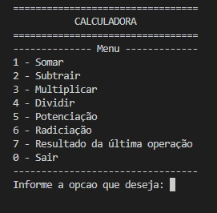
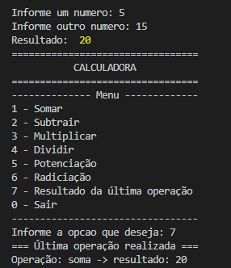
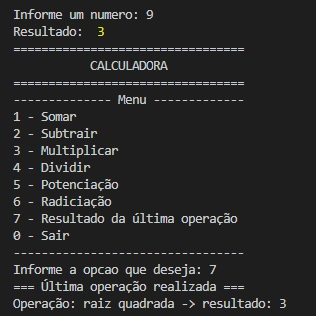

# Desafio: Desenvolvimento de Calculadora com JavaScript

## ℹ️ Sobre o desafio: 

Por meio deste programa você deve permitir realizar as operações de **soma**, **subtração**, **multiplicação**, **divisão**, **potenciação** e **radiciação**. Para tanto, você deverá criar uma classe chamada `Calculadora` para **implementar os métodos** das operações mencionadas e, no arquivo `index.js`, você deverá **criar um menu e funcionalidades que permitam realizar os cálculos** com base em uma opção selecionada.


### 🎯 Para a resolução deste desafio você precisará ter conhecimentos sobre:

* [x] Declaração de variáveis;
* [x] Operadores de comparação;
* [x] Condicional Switch e IF;
* [x] Laço de repetição Do While;
* [x] Funções;
* [x] Classes/POO;
* [x] Dependência: `readline-sync` para pegar as informações do usuário;


## Pré-requesitos para resolução do desafio

>[!IMPORTANT]
> 
> * [x] Ter uma IDE/editor de código, o Node e o  git instalados na máquina;
> * [x] Clique em `Fork` para realizar uma cópia do projeto para você  - `caso tenha alguma dúvida assista ao vídeo clicando no link a seguir`: [▶️Explicação sobre o Fork e Clonagem de repositório](https://youtu.be/L6HX3Kw359A)
> * [x] No seu computador, `clone a cópia do projeto que está em seu repositório` - **também mostro no link acima**:
>    ```shell
>    git clone suaURL
>    ```
> * [x] Com o projeto em sua máquina, abra a pasta dele na sua IDE e insira o comando `npm i` para instalar as dependências necessárias do projeto - neste caso, será instalado apenas o readline sync - (`utilize o terminal`).
>   
> * [x] Para executar o programa digite o comando a seguir: `node index`
>   


## ⚙️ Funcionalidades:

### Calculadora

Na `classe Calculadora`, você deverá implementar os métodos a seguir:

* `somar(num1, num2)`: Realize a operação utilizando o **operador** `+`;
* `subtrair(num1, num2)`: Realize a operação utilizando o **operador** `-`;
* `multiplicar(num1, num2)`: Realize a operação utilizando o **operador** `*`;
* `dividir(num1, num2)`: Realize a operação utilizando o **operador** `/`;
* `potencia(num1, num2)`: Realize a operação utilizando a **classe Math** com o **método** `Math.pow(num1, num2)`;
* `raizQuadrada(num1)`: Realize a operação utilizando a **classe Math** com o **método** `Math.sqrt(num1)`;

⚠️ Exporte a classe para ser utilizada no index.


### index (onde o programa vai rodar)

> Para interagir com o programa, utilize o `readline sync` que já consta no projeto para obter as informações do usuário por meio do teclado.

O programa deve rodar dentro de um `loop Do While` de forma infinita até que o usuário escolha finalizar o programa - `opcap = 0` - imprima a mensagem `Programa finalizado!`.


- **exibirMenu()**: Esta funcionalidade deve `imprimir um menu` com as opções disponíveis abaixo: 

| Opções do Menu |
|--- |
| 1 - Somar |
| 2 - Subtrair |
| 3 - Multiplicar |
| 4 - Dividir |
| 5 - Potenciação |
| 6 - Radiciação |
| 7 - Resultado da última operação | 
| 0 - Sair | 
||

 
 <br/>


- **realizarCalculo(num1, num2)**: Nesta função você deverá receber a entrada de 2 números - utilize o `input` do readline para obtê-los com o método `questionFloat("Informe um numero: ")`. ⚠️ `ATENÇÃO`: Caso o usuário digite a opção de nº 6, você deve `solicitar a inserção de apenas 1 número`. <br/>

Crie um `Switch` para `verificar` qual `opção` foi digitada e realize as seguintes ações com base na opção escolhida:

1. `nomeOperacaoEscolhida`: Atribua a esta variável o nome da operação que será realizada.
1. `resultado`: Atribua a esta variável o resultado da operação escolhida
1. `resultadoUltimaOperacao`: Atribua o valor da variável `resultado`;
1. `Finalize retornando o valor da variável resultado`;

⚠️ Caso você utilize o `código base` para resolver o desafio e veja que há a necessidade de criar novas variáveis, fique a vontade para implementá-las.

 <br/>


Crie um laço de `repetição Do While` para rodar a aplicação. Nele, você deverá `exibir o menu` - chame a função **exibirMenu()** e, em seguida, `solicitar ao usuário uma opção`. <br/>

Realize uma verificação com `if` para saber qual foi a opção selecionada e tomar a ação correta:
* Se `opção for MAIOR OU IGUAL 1` e `opção for MENOR OU IGUAL 6`: Chame a função `realizarCalculo(num1, num2)` imprimindo o resultado da operação realizada;
* Senão, se `opção for IGUAL A 7`: Imprima o `nome da última operação` realizada e o `seu resultado`;
* Caso não informe uma opção válida: Imprima a mensagem: `Operação inválida!`.


 
 <br/>

## 📊 Resultados esperados

### Exibição do Menu



<br/>


#### Operações com 2 números: Opções 1 a 5

No exemplo abaixo foi utilizada a `opção 1: somar` para exemplificar. Observe que `o programa solicita 2 números` ao usuário. <br/> **O mesmo deve ser feito com as opções 2, 3, 4 e 5**. Após realizar a soma, pedi para imprimir a `última operação com o seu respectivo valor - opção 7`.



<br/>

#### Operação com 1 número - Opção 6

Observe que ao escolher a `opção 6 - radiciação -`, **o programa solicitou apenas 1 número para realizar o cálculo**.




## ✅ Resolução do desafio

* [Resolução]() - ⚠️ Será disponibilizada em breve.